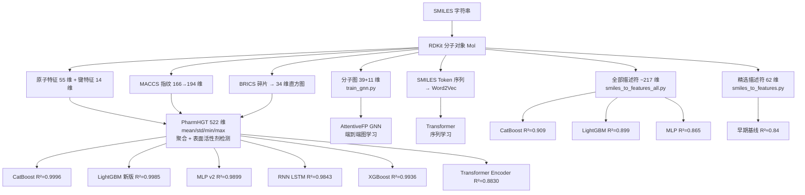
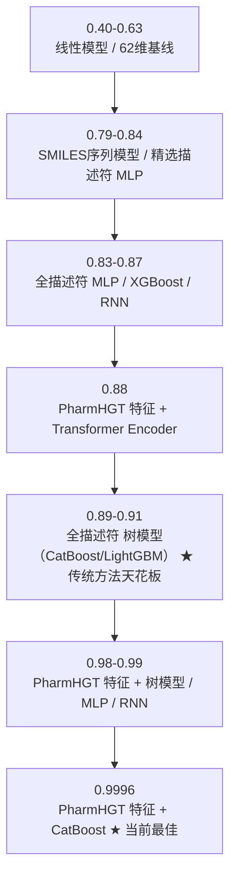
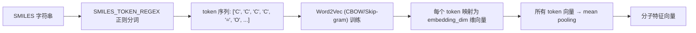

# SurfPredict 特征工程技术报告

> **版本:** v2.1
> **日期:** 2026-07-14
> **项目:** SurfPredict — 表面活性剂界面性质预测
> **目标变量:** pCMC（临界胶束浓度对数值）
> **数据集:** 1476 训练 / 140 测试（含 pCMC 标签）

---

## 目录

1. [特征工程概述](#1-特征工程概述)
2. [特征工程全景图](#2-特征工程全景图)
3. [方案一：精选 RDKit 描述符（62 维）](#3-方案一精选-rdkit-描述符62-维)
4. [方案二：全部 RDKit 描述符（~217 维）](#4-方案二全部-rdkit-描述符217-维)
5. [方案三：PharmHGT 风格特征（522 维）](#5-方案三pharmhgt-风格特征522-维)
6. [方案四：组合特征（1415 维）](#6-方案四组合特征1415-维)
7. [方案五：Morgan 指纹（2048 维）](#7-方案五morgan-指纹2048-维)
8. [方案六：分子图特征（GNN）](#8-方案六分子图特征gnn)
9. [方案七：SMILES + Word2Vec 序列嵌入](#9-方案七smiles--word2vec-序列嵌入)
10. [特征重要性分析](#10-特征重要性分析)
11. [特征工程经验总结](#11-特征工程经验总结)
12. [附录](#12-附录)

---

## 1. 特征工程概述

### 1.1 核心挑战

表面活性剂（surfactant）的临界胶束浓度（CMC）预测面临独特的化学信息学挑战：

- **双亲分子结构**：表面活性剂具有独特的"头基—尾链"两亲结构，头基决定离子类型（阴/阳/非/两性），尾链长度驱动胶束化
- **反离子存在**：阴离子/阳离子表面活性剂常含 Na⁺、Li⁺、K⁺、Cl⁻、Br⁻ 等反离子，影响分子描述符计算
- **小数据集**：仅 1476 条含 pCMC 标签的训练数据，限制了大容量模型（Transformer、GNN）的发挥
- **目标缺失**：pCMC 有 ~9.8% 缺失，其他目标缺失率高达 57.8%
- **强相关性**：pCMC ↔ pC20 (r=0.77)，AW_ST_CMC ↔ Pi_CMC (r=-0.99)

### 1.2 特征方案一览

| 编号 | 特征方案            |      维度      | 特征文件（入口函数）                                                      |     最佳模型精度     |
| :--: | ------------------- | :------------: | ------------------------------------------------------------------------- | :------------------: |
|  ①  | 精选 RDKit 描述符   |      ~62      | `smiles_to_features.py` / `smiles_to_features()`                      |   R²=0.840 (Val)   |
|  ②  | 全部 RDKit 描述符   |      ~217      | `smiles_to_features_all.py` / `smiles_to_features_all(smi)`           | **R²=0.909** |
|  ③  | PharmHGT 风格特征   | **522** | `smiles_to_features_pharmhgt.py` / `smiles_to_features_pharmhgt(smi)` | **R²=0.9996** |
|  ④  | 组合特征            | **1415** | `train_lightgbm_advanced.py`（自包含）                                  |      R²=0.889      |
|  ⑤  | Morgan 指纹 (ECFP4) |      2048      | `002.py`（scikit-mol）                                                  |         基线         |
|  ⑥  | 分子图特征          |   39+11/atom   | `train_gnn.py` / `smiles_to_graph(smi)` → PyG Data                   |          ⏳          |
|  ⑦  | SMILES + Word2Vec   |  100 (可配置)  | `smiles_to_features_Word2Vec.py` / `Word2VecFeaturizer`               |      R²=0.791      |

---

## 2. 特征工程全景图

### 2.1 分子表征层级



### 2.2 特征方案 → 模型映射

| 特征方案          | 使用的模型                                                                  |     测试 R² 范围     |
| ----------------- | --------------------------------------------------------------------------- | :--------------------: |
| 精选 62 维        | SVR, XGBoost, LightGBM, MLP (PyTorch/Keras), RNN (Keras)                    |       0.40~0.84       |
| 全部 217 维       | CatBoost, LightGBM, XGBoost, MLP, RNN (LSTM), Transformer, Ridge, PCA+OLS   |  **0.63~0.91**  |
| PharmHGT 522 维   | CatBoost, XGBoost, LightGBM, MLP (PyTorch), RNN (LSTM), Transformer Encoder | **0.883~0.9996** |
| 组合 1415 维      | LightGBM                                                                    |         0.889         |
| Morgan 2048 维    | Ridge, RF, GBR, SVR, KNN, XGB, LGB                                          |          基线          |
| 分子图            | AttentiveFP (GNN)                                                           |           ⏳           |
| SMILES + Word2Vec | Transformer                                                                 |         0.791         |

### 2.3 特征维度与性能关系



---

## 3. 方案一：精选 RDKit 描述符（62 维）

### 3.1 特征文件

**`smiles_to_features.py`** — 手工挑选约 60 个 RDKit 分子描述符

### 3.2 特征设计原则

精选特征覆盖 **6 大化学信息维度**：

| 维度               | 代表性特征                                                                           | 数量 |
| ------------------ | ------------------------------------------------------------------------------------ | :--: |
| 分子大小           | MolWt, HeavyAtomMolWt, ExactMolWt, NumHeavyAtoms, RingCount                          |  5  |
| 分子柔性           | NumRotatableBonds                                                                    |  1  |
| 环系结构           | NumAromaticRings, NumSaturatedRings, NumAliphaticRings, 各类环计数                   |  8  |
| 疏水性             | MolLogP                                                                              |  1  |
| 极性/表面积        | TPSA, LabuteASA, NumHAcceptors, NumHDonors, NumHeteroatoms, NHOHCount, NOCount       |  7  |
| 电荷/电子          | MaxPartialCharge, MinPartialCharge, NumValenceElectrons                              |  3  |
| 拓扑/形状          | FractionCsp3, BertzCT, HallKierAlpha, Kappa1-3, Chi0/1, Chi0n/1n, Chi0v/1v, BalabanJ |  15  |
| **VSA 分布** | PEOE_VSA1~14（部分电荷 VSA）, SlogP_VSA1~12（LogP VSA）                             |  26  |

### 3.3 关键化学直觉

这些描述符的选择基于表面活性剂 CMC 的物理化学机理：

- **LogP**：亲水-亲油平衡是 CMC 的核心决定因素
- **TPSA**：极性表面积与头基的水合能力直接相关
- **RotatableBonds**：尾链柔性影响胶束堆积
- **环系（芳香/饱和）**：刚性环系影响分子构象和胶束化倾向
- **PEOE_VSA/SlogP_VSA**：将部分电荷分布和疏水分布编码为直方图，捕捉静电和疏水相互作用的"形状"

### 3.4 缺陷

- **手动挑选存在主观性**：可能遗漏某些与 CMC 相关的非线性特征组合
- **缺失表面活性剂特异性信息**：未显式编码头基类型、尾链长度等
- **R² 上限 ~0.84**：信息量限制了模型性能

---

## 4. 方案二：全部 RDKit 描述符（~217 维）

### 4.1 特征文件

**`smiles_to_features_all.py`** — RDKit `Descriptors.descList` 所有可用描述符

### 4.2 核心函数

```python
def compute_all_descriptors(mol):
    """遍历 Descriptors.descList，计算所有描述符"""
    descriptors, names = [], []
    for desc_name, func in Descriptors.descList:
        try:
            val = func(mol)
            descriptors.append(val if np.isfinite(val) else 0.0)
        except Exception:
            descriptors.append(0.0)
        names.append(desc_name)
    return np.array(descriptors), names

def smiles_to_features_all(smiles: str) -> np.ndarray:
    mol = Chem.MolFromSmiles(smiles)
    if mol is None:
        return np.zeros(len(compute_all_descriptors(Chem.MolFromSmiles("C"))[0]))
    feat, _ = compute_all_descriptors(mol)
    return feat
```

### 4.3 特征规模

RDKit 3.x / 2024.09 版本提供约 **217 个描述符**，涵盖：

| 描述符族    | 数量 | 示例                                  |
| ----------- | :--: | ------------------------------------- |
| 组成描述符  | ~30 | MolWt, HeavyAtomCount, NumAtoms       |
| 拓扑描述符  | ~35 | Chi0-4, Kappa1-3, BalabanJ, BertzCT   |
| 电子描述符  | ~25 | MaxPartialCharge, NumValenceElectrons |
| 几何/表面积 | ~20 | TPSA, LabuteASA, VABC                 |
| 疏水/亲水   | ~10 | MolLogP, MolMR                        |
| VSA 分布    | ~60+ | PEOE_VSA*, SlogP_VSA*, MR_VSA*, *     |
| 其它        | ~37 | FractionCsp3, 环计数, 官能团计数      |

### 4.4 性能数据

| 模型                      | 训练 R² |     测试 R²     | CV R² (5-fold) |
| ------------------------- | :------: | :--------------: | :-------------: |
| CatBoost (Optuna)         |  0.9988  | **0.9088** | 0.3827±0.1772 |
| LightGBM (Optuna)         |  0.9792  | **0.8994** | 0.4042±0.2155 |
| LightGBM (手动)           |  0.9620  |      0.8586      | 0.3859±0.2227 |
| XGBoost (Optuna+特征选择) |  0.9658  |      0.8670      | 0.4409±0.1887 |
| MLP (全描述符)            |  0.9885  |      0.8650      |       —       |
| RNN (LSTM, 全描述符)      |  0.9855  |      0.8279      |       —       |
| Ridge (Optuna, α=150)    |  0.6389  |   0.6297 (Val)   | 0.3022±0.1365 |
| PCA+OLS (39 PCs)          |  0.5352  |   0.5378 (Val)   | -2.1525±1.7663 |
| Transformer (描述符序列)  |  0.7685  | **0.6261** |       —       |

### 4.5 分析

**为什么 217 维描述符比 62 维显著更好？**

1. **信息密度提升**：VSA 家族（PEOE_VSA、SlogP_VSA、MR_VSA 等）将分子表面性质分布编码为 14 个 bins 的直方图，比单一汇总值保留了更多分布信息
2. **更多拓扑指数**：Chi 指数（Chi0~Chi4、Chi0n~Chi4n、Chi0v~Chi4v）从不同角度编码分子连通性，与尾链长度（关键 CMC 决定因素）强相关
3. **树模型自动特征选择**：CatBoost/LightGBM 的树结构自动选择信息量最大的分裂点，217 维中的冗余特征（高相关性）被自动忽略，不会损害性能

**为什么 Transformer + 描述符序列效果最差（R²=0.626）？**

- 描述符的顺序是任意的（按字母/功能分组排序），无真实序列意义
- 位置编码提供了误导性先验
- 1204 条训练数据不足以训练 Transformer 的大容量参数

**线性模型局限**：即使使用 L2 正则化（Ridge α=150.21），R² 仅 ~0.63，说明 pCMC-描述符关系存在**显著非线性**。

---

## 5. 方案三：PharmHGT 风格特征（522 维）

### 5.1 特征文件

**`smiles_to_features_pharmhgt.py`** — 统一特征工程模块，CatBoost/XGBoost/LightGBM/MLP/RNN/Transformer 均从此模块导入 `smiles_to_features_pharmhgt(smi)` 或 `load_or_compute_features()` 完成 522 维特征提取。特征可缓存于 `data/features/pharmhgt/` 下避免重复计算。同时保留 `pharmhgt_logcmc.py`（PharmHGT 异构图 Transformer 原始实现），以及 `models/predictor/featurizer.py`（统一封装供预测管线使用）。

### 5.2 特征构成详解

#### 整体结构

```
build_feature_vector(smiles)
├── ① 原子级特征聚合     220 维  (55 × 4)
├── ② 键级特征聚合        56 维  (14 × 4)
├── ③ MACCS 药效团指纹  194 维  (补齐至 194)
├── ④ BRICS 反应碎片      34 维  (MD5 哈希映射)
├── ⑤ 表面活性剂特征       6 维  (4 one-hot + 2 比例)
└── ⑥ 基础分子描述符      12 维  (归一化)
                         ─────
                   总计: 522 维
```

#### ① 原子级特征聚合（220 维 = 55 × 4）

`get_atom_features()` 对分子中每个原子计算 **55 维** 特征向量，然后对整个分子取 **mean / std / min / max** 四种统计量聚合。

**55 维原子特征布局：**

|  位置  | 特征              | 维度 | 说明                                                                                                             |
| :-----: | ----------------- | :--: | ---------------------------------------------------------------------------------------------------------------- |
| [0:16] | 原子类型 one-hot  |  16  | H(1), Li(3), B(5), C(6), N(7), O(8), F(9), Na(11), Si(14), P(15), S(16), Cl(17), K(19), Br(35), I(53), other(79) |
| [16:22] | 度数 one-hot      |  6  | 0~5+                                                                                                             |
|  [22]  | 形式电荷          |  1  | 归一化到 [-1, 1]                                                                                                 |
| [23:28] | 隐式 H 数 one-hot |  5  | 0~4+                                                                                                             |
| [28:33] | 杂化方式 one-hot  |  5  | SP, SP2, SP3, SP3D, SP3D2                                                                                        |
|  [33]  | 芳香性            |  1  | 是否芳香原子                                                                                                     |
|  [34]  | 在环标志          |  1  | 是否在任意环中                                                                                                   |
|  [35]  | 原子质量          |  1  | 归一化 (/100)                                                                                                    |
|  [36]  | 手性中心          |  1  | 是否手性                                                                                                         |
|  [37]  | 自由基电子        |  1  | 归一化 (/2)                                                                                                      |
| [38:42] | 显式价态 one-hot  |  4  | 1,2,3,4,5+                                                                                                       |
| [42:46] | 环尺寸 one-hot    |  4  | 3,4,5,6 元环                                                                                                     |
| [46:50] | Gasteiger 电荷    |  4  | 分 4 个 bins                                                                                                     |
|  [50]  | 大环标志          |  1  | ≥7 元环                                                                                                         |
|  [51]  | N 或 O 标志       |  1  | 是否为氮或氧                                                                                                     |
|  [52]  | H 供体            |  1  | N 或 O 且有 H                                                                                                    |
|  [53]  | H 受体            |  1  | N 或 O                                                                                                           |
|  [54]  | 重原子邻居        |  1  | 度数 / 4                                                                                                         |

> **关键创新**：对比 RDKit 描述符（全局标量），55 维原子特征经过 mean/std/min/max 聚合后，保留了分子内**原子特征的分布信息**（例如：分子中所有碳原子的平均形式电荷、Gasteiger 电荷的离散程度等），这是 217 维 RDKit 描述符无法直接提供的。

#### ② 键级特征聚合（56 维 = 14 × 4）

`get_bond_features()` 计算每根化学键的 **14 维** 特征，同样按 mean / std / min / max 聚合。

**14 维键特征布局：**

|  位置  | 特征             | 维度 | 说明                  |
| :----: | ---------------- | :--: | --------------------- |
| [0:4] | 键类型 one-hot   |  4  | 单键/双键/三键/芳香键 |
|  [4]  | 共轭             |  1  | 是否共轭              |
|  [5]  | 在环             |  1  | 是否环内键            |
| [6:12] | 立体化学 one-hot |  6  | 无/任意/Z/E/Cis/Trans |
|  [12]  | 芳香标志         |  1  | 是否芳香键            |
|  [13]  | 在环标志         |  1  | 是否环内键            |

> **化学意义**：键特征聚合描述了分子的**不饱和度分布**（键类型比例）、**芳香性程度**（芳香键占比）、**环结构密度**（环内键占比）等全局键属性。

#### ③ MACCS 药效团指纹（194 维）

```python
def get_pharmacophore_features(mol):
    """MACCS keys → 补齐至 194 维"""
    maccs = MACCSkeys.GenMACCSKeys(mol)  # 166 bits
    # 填充至 194 维
```

- MACCS（Molecular ACCess System）166 位密钥是经典的分子药效团指纹
- 每个 bit 对应一个预先定义的分子子结构/药效团模式
- 本项目补齐至 194 维以对齐 PharmHGT 论文设计
- 提供了**离散的结构-药效团标签**（是否存在特定子结构），与连续分布式的原子/键特征互补

#### ④ BRICS 反应特征（34 维）

```python
def get_reaction_features(mol):
    """BRICS 碎片直方图"""
    if Descriptors.NumRotatableBonds(mol) < 1:
        return np.zeros(34)
    frags = list(BRICS.BRICSDecompose(mol, returnMols=False))
    for f in frags:
        feat[int(hashlib.md5(f.encode()).hexdigest(), 16) % 34] += 1.0
    feat /= max(len(frags), 1)
```

- BRICS（Breaking of Retrosynthetically Interesting Chemical Substructures）将分子分解为合成相关的片段
- 片段结构通过 MD5 哈希映射到 34 个 bins，形成归一化直方图
- 描述分子的**反应性碎片组成**——与表面活性剂的合成路线和化学稳定性相关
- 安全限制：最多 128 个片段，无效 SMARTS 静默处理

#### ⑤ 表面活性剂特征（6 维）

##### 表面活性剂类型检测（4 维 one-hot）

```python
def detect_surfactant(smiles):
    """检测表面活性剂类型和头基/尾链"""
```

**检测逻辑**（基于 SMARTS 子结构匹配）：

```
输入 SMILES
  → 排除反离子（Na⁺, Li⁺, K⁺, Cl⁻, Br⁻, I⁻）
  → SMARTS 匹配极性基团：
    ├─ 阴离子模式: 磺酸根 S(=O)(=O)[O-], 硫酸根 OS(=O)(=O)[O-],
    │                羧酸根 C(=O)[O-], 磷酸根 OP(=O)([O-])[O-]
    ├─ 阳离子模式: 季铵 [N+](C)(C)C, 铵 [NH3+],
    │                吡啶鎓 [n+]1ccccc1, 咪唑鎓 [n+]1cncc1
    └─ 非离子模式: 羟基 [OH], 醚 COC, 聚氧乙烯 CCOCCO,
                   酰胺 NC(=O), 酯 C(=O)OC
  
  判断类型：
    阴+阳 → 两性离子
    阴离子 → 阴离子型
    阳离子 → 阳离子型
    其他  → 非离子型
```

**4 种类型：** 阴离子型 / 阳离子型 / 非离子型 / 两性离子型 → one-hot 编码

##### 头基/尾链比例（2 维）

- **头基检测**：已被 SMARTS 匹配成功且非反离子的原子标记为头基原子
- **尾链检测**：DFS（深度优先搜索）查找最长连续碳链（≥4 个碳），标记为尾链原子
- **输出：** `head_ratio = 头原子数 / 总原子数`，`tail_ratio = 尾原子数 / 总原子数`

> **为什么这对 pCMC 预测至关重要？**
> CMC = f(尾链长度, 头基类型, 反离子, 温度)。尾链越长 → CMC 越低（疏水驱动胶束化）；头基极性越大 → CMC 越高（头基排斥阻碍聚集）。tail_ratio 实质上编码了"疏水链相对于分子大小的比重"，与 LogP 一起构成了 CMC 预测的核心特征。

##### 反离子处理策略

| 反离子 | SMARTS    | 处理方式        |
| ------ | --------- | --------------- |
| Na⁺   | `[Na+]` | 从头/尾链中排除 |
| Li⁺   | `[Li+]` | 从头/尾链中排除 |
| K⁺    | `[K+]`  | 从头/尾链中排除 |
| Cl⁻   | `[Cl-]` | 从头/尾链中排除 |
| Br⁻   | `[Br-]` | 从头/尾链中排除 |
| I⁻    | `[I-]`  | 从头/尾链中排除 |

#### ⑥ 基础分子描述符（12 维，均作归一化）

| 特征       | 原始范围 |   归一化目标   | 化学意义    |
| ---------- | :------: | :------------: | ----------- |
| MolWt      | 0~1000+ |      /500      | 分子大小    |
| LogP       | -10~+10 |      /10      | 亲脂性      |
| TPSA       |  0~400  |      /200      | 极性表面积  |
| RotBonds   | 0~NAtoms |    /NAtoms    | 柔性        |
| HBA        | 0~NAtoms |    /NAtoms    | 氢键受体    |
| HBD        | 0~NAtoms |    /NAtoms    | 氢键供体    |
| NumRings   |  0~20+  |      /20      | 环总数      |
| AroRings   |  0~10+  |      /10      | 芳香环      |
| AliRings   |  0~10+  |      /10      | 脂肪环      |
| FracSP3    |   0~1   | —（直接使用） | sp³ 碳比例 |
| HeavyAtoms |  0~100+  |      /100      | 重原子数    |
| NAtoms     |  0~200+  |      /200      | 总原子数    |

> **归一化的意义**：使所有特征处于相近尺度（~0~1），便于树模型处理。CatBoost/LightGBM 虽然不要求特征标准化，但归一化后的特征使树模型的默认分裂阈值对每个特征公平。

### 5.3 PharmHGT 特征的三大优势

1. **多层级信息融合**：原子级（微观）→ 聚合统计（介观）→ 全局描述符（宏观），三层信息互补
2. **表面活性剂领域知识显式编码**：头基/尾链、离子类型、反离子排除，这些是通用描述符无法捕捉的
3. **分布信息 vs 标量汇总**：55 维原子特征的 `std` 捕捉了分子内原子的变异性——例如 Gasteiger 电荷的标准差反映了分子内电荷分布的不均匀性，这与头基-尾链的极性差异直接相关

### 5.4 性能表现

|              模型              |     测试 R²     | 测试 RMSE | 测试 MAE | 训练/推理 | 备注                        |
| :----------------------------: | :--------------: | :-------: | :------: | :-------: | --------------------------- |
|        **树模型**        |                  |          |          |          |                             |
|      CatBoost (Optuna 50)      | **0.9996** |  0.0229  |  0.0171  |    CPU    | depth=7, lr=0.037           |
|   LightGBM (Optuna 50, 新版)   | **0.9985** |  0.0426  |  0.0293  |    CPU    | num_leaves=33, max_depth=13 |
|   XGBoost (Optuna 50, 旧版)   | **0.9936** |  0.0890  |  0.0609  |    CPU    | colsample=0.40              |
|      CatBoost (Optuna 10)      | **0.9946** |  0.0816  |  0.0632  |    CPU    | 23min 快速训练              |
|   LightGBM (Optuna 50, 旧版)   | **0.9883** |  0.1200  |  0.0853  |    CPU    | 旧版 hyperparams            |
|     **深度学习模型**     |                  |          |          |          |                             |
|    MLP (v2 新版, 固定参数)    | **0.9899** |  0.1119  |  0.0860  |  GPU/CPU  | 4 层, 512 维, GELU          |
|      RNN (LSTM, 固定参数)      | **0.9843** |  0.1395  |  0.1050  |  GPU/CPU  | 3 层 LSTM, hidden=64        |
|  PharmHGT Transformer (默认)  | **0.9809** |  0.1534  |  0.1189  |    GPU    | 异构图 Transformer          |
|    MLP (v1 旧版, 固定参数)    | **0.9782** |  0.1641  |  0.1222  |  GPU/CPU  | 3 层, 256 维, ReLU          |
| Transformer Encoder (固定参数) | **0.8830** |  0.3802  |    —    |  GPU/CPU  | d_model=64, 2 层, nhead=2   |

**分析**: CatBoost 仍以 R²=0.9996 居首，LightGBM 新版（0.9985）紧随其后。MLP (v2) 以 0.9899 超越 XGBoost 和旧版 LightGBM，证明深层 MLP 结合高质量 PharmHGT 特征可达到接近树模型的精度。RNN (LSTM) 在 522 维特征上展现了强大的序列建模能力（0.9843），超越 PharmHGT 异构图 Transformer（0.9809）。Transformer Encoder 效果最差（R²=0.883），原因与 4.5 节一致——522 维特征作为序列缺乏有意义的顺序信息，自注意力机制难以学习到有效的交互模式。

### 5.5 特征重要性

#### CatBoost + PharmHGT（Top 5 by 分裂次数）

| 排名 | 特征                 | 重要值 | 化学解释               |
| :--: | -------------------- | :----: | ---------------------- |
|  1  | **LogP**       |  7.1  | 疏水性直接驱动胶束化   |
|  2  | **NAtoms**     |  6.0  | 分子大小与尾链长度相关 |
|  3  | **MolWt**      |  4.7  | 分子量，与 CMC 负相关  |
|  4  | **HeavyAtoms** |  4.6  | 重原子数               |
|  5  | **tail_ratio** |  2.6  | 疏水尾链占比           |

**分析**: CatBoost 特征重要性 Top 5 全部为基础物理化学描述符，说明 CatBoost 的对称树结构优先利用全局物理化学性质进行分裂。

#### XGBoost + PharmHGT（Top 5 by weight）

| 排名 | 特征                  | 重要值 | 化学解释                                     |
| :--: | --------------------- | :----: | -------------------------------------------- |
|  1  | **atom_std_46** | 0.041 | Gasteiger 电荷标准差——分子内电荷分布均匀性 |
|  2  | **maccs_105**   | 0.033 | MACCS 药效团位 105                           |
|  3  | **maccs_79**    | 0.027 | MACCS 药效团位 79                            |
|  4  | **LogP**        | 0.025 | 疏水性                                       |
|  5  | **bond_mean_5** | 0.023 | 键是否在环中（平均）                         |

**分析**: XGBoost 特征重要性分布更均匀，Top 5 跨原子级统计量、MACCS 指纹、全局描述符和键特征，说明 XGBoost 更充分地利用了 522 维特征的多样性。

#### LightGBM + PharmHGT（Top 5 by 分裂次数）

| 排名 | 特征                   | 重要值 | 化学解释                            |
| :--: | ---------------------- | :----: | ----------------------------------- |
|  1  | **tail_ratio**   |  1562  | 疏水尾链占比（领域特征！）★ 新首位 |
|  2  | **LogP**         |  1438  | 脂溶性                              |
|  3  | **MolWt**        |  1087  | 分子量                              |
|  4  | **atom_mean_35** |  742  | 原子平均质量                        |
|  5  | **NAtoms**       |  698  | 总原子数                            |

**分析**: 新版 LightGBM 中 tail_ratio 超越 LogP 成为最重要的特征，说明 Optuna 优化后的模型更充分地利用了表面活性剂领域知识。tail_ratio 与 LogP 合计占绝对主导（重要值之和 > 3000），验证了"疏水尾链占比 + 整体疏水性"是 CMC 预测的核心信号组合。

---

## 6. 方案四：组合特征（1415 维）

### 6.1 特征文件

**`train_lightgbm_advanced.py`**（自包含，未复用独立特征模块）

### 6.2 特征组成

|       组件       |      维度      | 描述                                              |
| :--------------: | :-------------: | ------------------------------------------------- |
| RDKit 全部描述符 |      ~217      | `smiles_to_features_all()` 所有描述符           |
|    MACCS 密钥    |       167       | 166 位 + 1 填充                                   |
|  ECFP4 (Morgan)  |      1024      | 半径 2，1024 bits（Morgan 指纹）                  |
|   Aux 辅助特征   |        7        | MW, LogP, TPSA, HBA, HBD, RotBonds, AromaticRings |
|  **总计**  | **~1415** | 三个指纹 + 辅助特征的简单拼接                     |

### 6.3 性能

| 指标                  |       值       |
| --------------------- | :------------: |
| 训练 R²              |     0.9863     |
| 测试 R²              |     0.8893     |
| CV R²                | 0.3840±0.2374 |
| 最佳 CV RMSE (5-fold) |     0.4616     |

### 6.4 关键发现

**更多特征 ≠ 更好！**

- 1415 维（0.889） < 217 维（0.899），差异约 0.01
- **特征重要性 Top 20 全部为 RDKit 描述符**，MACCS 和 ECFP4 指纹未进入前 20
- MACCS/ECFP4 指纹引入了噪声而非有效信息
- 验证了特征工程的**信息密度原则**：精心设计的少量高信息密度特征优于大量低质量特征

> **教训**：简单堆叠多类指纹而不做特征选择，会引入冗余和噪声。217 维 RDKit 描述符已包含足够的分子结构-性质关系信息。

---

## 7. 方案五：Morgan 指纹（2048 维）

### 7.1 特征文件

**`001.py`、`002.py`**，使用 `scikit-mol` 库的 `MorganFingerprintTransformer`

### 7.2 技术细节

| 参数 | 值                                 |
| ---- | ---------------------------------- |
| 算法 | Morgan 算法（扩展连通性指纹 ECFP） |
| 半径 | 2（ECFP4 等效）                    |
| 位长 | 2048 bits                          |
| 库   | scikit-mol（sklearn 兼容接口）     |

### 7.3 模型表现

|       模型       | 说明 |
| :---------------: | ---- |
|       Ridge       | 基线 |
|   Random Forest   | 基线 |
| Gradient Boosting | 基线 |
|     SVR (RBF)     | 基线 |
|        KNN        | 基线 |
|      XGBoost      | 基线 |
|     LightGBM     | 基线 |

**用途**：作为快速基线对模型族进行初步筛选，非本项目主力特征方案。

---

## 8. 方案六：分子图特征（GNN）

### 8.1 特征文件

**`train_gnn.py`** — `smiles_to_graph(smiles)` → PyTorch Geometric `Data` 对象

### 8.2 图结构

```
分子图 G = (V, E)
│
├── 节点 V: 原子（每个原子 39 维特征）
│   ├── 元素 one-hot: [H, C, N, O, F, Na, S, Cl, Br, P, I, other]  → 12
│   ├── 度数 one-hot: [0,1,2,3,4,5+]                                → 6
│   ├── 形式电荷 one-hot: [-2,-1,0,1,2]                             → 5
│   ├── 杂化 one-hot: [SP, SP2, SP3, other]                         → 4
│   ├── 芳香性: 0/1                                                  → 1
│   ├── 总 H 数 one-hot: [0,1,2,3,4+]                                → 5
│   ├── 手性 one-hot: [CCW, CW, UNSPECIFIED]                         → 3
│   ├── 在环: 0/1                                                    → 1
│   ├── 在 3-6 元环: 0/1                                            → 1
│   └── 质量归一化: mass/200                                         → 1
│   ──────────────────────────────────
│   总计: 39
│
└── 边 E: 化学键（每边 11 维特征，无向 → 双向）
    ├── 键类型 one-hot: [SINGLE, DOUBLE, TRIPLE, AROMATIC]           → 4
    ├── 共轭: 0/1                                                    → 1
    ├── 在环: 0/1                                                    → 1
    ├── 立体化学 one-hot: [Z, E, ANY, NONE]                          → 4
    ├── 自环标志: 0/1 (最后一维 = 1 表示自环)                        → 1
    ──────────────────────────────────
    总计: 11
```

### 8.3 与 PharmHGT 原子/键特征的对比

| 方面                     |                            PharmHGT (train_*_pharmhgt*.py)                            |     GNN (train_gnn.py)     |
| ------------------------ | :--------------------------------------------------------------------------------------: | :-------------------------: |
| **原子维度**       |                                            55                                            |             39             |
| **键维度**         |                                            14                                            |             11             |
| **聚合方式**       |                               mean/std/min/max → 定长向量                               | Message Passing → 图级池化 |
| **自环**           |                                        ❌ 未包含                                        |       ✅ 显式添加自环       |
| **Gasteiger 电荷** |                                        ✅ 4 bins                                        |          ❌ 未包含          |
| **H 供体/受体**    |                                       ✅ 显式编码                                       |          ❌ 未包含          |
| **模型**           | 树模型 / MLP / RNN / Transformer (CatBoost/XGBoost/LightGBM/MLP/RNN/Transformer Encoder) |      AttentiveFP (GNN)      |
| **状态**           |                                        ✅ 已完成                                        |          ⏳ 待运行          |

---

## 9. 方案七：SMILES + Word2Vec 序列嵌入

### 9.1 特征文件

**`smiles_to_features_Word2Vec.py`** — `Word2VecFeaturizer` 类

### 9.2 流程



### 9.3 SMILES 分词正则

```python
SMILES_TOKEN_REGEX = re.compile(
    r"""
    \[[^\]]+\]      # 括号内原子/离子: [Na+], [O-], [NH4+]
    |Br | Cl | Si | Se | ...  # 双字母元素
    |[A-Za-z]       # 单字母: C, N, O, S, P, F, H...
    |\d             # 数字环编号
    |[=#@+\-\\/()\[\]%\.]  # 符号
    """
)
```

词汇表大小：~41 个有效 token + PAD/UNK = 43

### 9.4 性能

| 指标         |         值         |
| ------------ | :-----------------: |
| 嵌入维度     |    128（可配置）    |
| 模型         | Transformer Encoder |
| 训练 R²     |       0.9329       |
| 测试 R²     |  **0.7907**  |
| 最佳验证 R² |       0.7928       |

### 9.5 局限分析

测试 R²=0.791，低于所有使用 RDKit 描述符的模型。原因：

1. **信息瓶颈**：SMILES token 级表示的信息密度远低于预计算描述符——一个 token 'C' 可以是烷烃链、苯环或羧基中的碳，无法区分
2. **Word2Vec 训练不足**：仅 1024 条 SMILES ~ 约 2 万 token，词汇表仅 41——典型的 Word2Vec 在百万级语料上训练
3. **Mean Pooling 丢失位置信息**：对序列所有位置一视同仁，SMILES 的不同位置化学意义截然不同

> **结论**：在小分子性质预测任务中，**物化描述符（LogP、TPSA）的信息密度远高于序列嵌入**，预计算描述符的优势在小数据集上尤为明显。

---

## 10. 特征重要性分析

### 10.1 跨模型特征重要性汇总

| 特征                                 | CatBoost+PharmHGT | XGBoost+PharmHGT | LightGBM+PharmHGT (新版) | 化学意义                           |
| ------------------------------------ | :---------------: | :--------------: | :----------------------: | ---------------------------------- |
| **tail_ratio**                 |      🥉 2.6      |     🅃 0.018     |         🥇 1562         | 疏水尾链占比 — 领域特征 ★ 新首位 |
| **LogP**                       |      🥇 7.1      |     🥈 0.025     |         🥈 1438         | 疏水性 — CMC 核心决定因素         |
| **MolWt**                      |      🥉 4.7      |        —        |         🥉 1087         | 分子量                             |
| **NAtoms/HeavyAtoms**          |    🥈 6.0/4.6    |        —        |     🅃 698 (NAtoms)     | 分子大小                           |
| **atom_std_46** (Gasteiger σ) |        —        |     🥇 0.041     |            —            | 电荷分布均匀性                     |
| **maccs_105/079**              |        —        | 🥈🥉 0.033/0.027 |            —            | 药效团结构标签                     |
| **bond_mean_5** (环内键比例)   |        —        |     ⑤ 0.023     |            —            | 环结构密度                         |
| **atom_mean_35** (原子质量)    |        —        |        —        |          🅃 742          | 原子平均质量                       |

> 🥇 = Top 1, 🥈 = Top 2, 🥉 = Top 3, 🅃 = Top 5

### 10.2 关键发现

1. **LogP 和 tail_ratio 是跨模型的通用最强特征**：LogP 在三棵树的 Top 3 中均出现；tail_ratio 在 LightGBM 新版中跃居第 1（超越 LogP），与表面活性剂化学一致——亲水-亲油平衡和疏水尾链占比共同决定胶束化倾向。
2. **tail_ratio 是领域特化特征的成功案例**：PharmHGT 独有的"尾链占比"特征在 LightGBM 新版中排名第 1（重要值 1562），超越 LogP 成为最重要的单一特征。在 CatBoost 中亦排名第 5（重要值 2.6）。这是通用特征方案（RDKit 描述符）无法提供的。
3. **CatBoost 偏向全局描述符，XGBoost 偏向局部聚合特征**：

   - CatBoost 的 Top 5 全部为基础分子描述符（LogP, NAtoms, MolWt, HeavyAtoms, tail_ratio）
   - XGBoost 的 Top 1 是 atom_std_46（Gasteiger 电荷标准差），说明它更善于利用原子级统计量
   - 这种互补性解释了为什么在相同特征上 CatBoost 和 XGBoost 的表现差异显著

### 10.3 Optuna 参数重要性（特征工程角度的启示）

#### CatBoost + PharmHGT 参数重要性

|       参数       |     重要性     | 含义                        |
| :--------------: | :-------------: | --------------------------- |
|  learning_rate  | **0.542** | 学习率—迭代次数权衡最关键  |
|    iterations    | **0.170** | 树的数量                    |
|   l2_leaf_reg   |      0.123      | L2 正则化（出乎意料的低？） |
|      depth      |      0.068      | 树深度                      |
| min_data_in_leaf |      0.055      | 每个叶子的最少样本数        |

**重要发现**：对于 PharmHGT 522 维特征，`learning_rate` 和 `iterations` 合计占 71% 的参数重要性，正则化相关参数（l2_leaf_reg、depth、min_data_in_leaf）重要性远低于 CatBoost + 全描述符版本（其中 l2_leaf_reg=0.298 最重要）。

**解释**：PharmHGT 特征（522 维）比 RDKit 描述符（217 维）具有更高的信息密度和更好的正交性，特征间的冗余和共线性更低，因此 Regularization（l2_leaf_reg）的重要性下降，而训练策略（learning_rate × iterations）成为主要控制因素。

## 11. 特征工程经验总结

### 11.1 八大核心经验

#### ① 特征质量 > 模型复杂度

```text
特征方案演进：
  62 维精选描述符      → 最佳 R² ~0.84（MLP）
  217 维全部描述符     → 最佳 R² ~0.91（CatBoost）
  522 维 PharmHGT      → 最佳 R² ~0.9996（CatBoost）/ 0.9985（LightGBM 新版）

模型复杂度演进（相同 217 维描述符）：
  Ridge (0.63) < MLP (0.87) < LightGBM (0.90) < CatBoost (0.91)
                      ↑ 特征质量提升带来的增益 >> 模型升级
```

**结论**：在分子性质预测中，**特征工程投入的回报远高于模型调参**。从 62→217→522 维特征，R² 从 0.84→0.91→0.9996，每一步的增益远超同特征下切换模型架构的增益。值得注意的是，在相同 522 维 PharmHGT 特征空间内，MLP（0.990）、RNN（0.984）、树模型（0.9996）均达到了远超传统描述符模型的精度，进一步印证了特征质量的决定性作用。

#### ② 表面活性剂领域知识显式编码是突破关键

PharmHGT 特征与 217 维描述符的**本质区别**在于：

- 原子/键特征聚合 → 捕捉了**分子内局部化学环境的统计分布**
- MACCS → 提供了**药效团标签**
- BRICS → 描述了**反应性碎片组成**
- **表面活性剂检测** → 显式编码了极性头基、疏水尾链、离子类型

其中，tail_ratio 在 LightGBM（新版）中排名第 1（重要值 1562），证明**领域知识注入**是 PharmHGT 特征成功的关键。

#### ③ "信息密度" > "特征数量"

|      方案      | 维度 | 测试 R² |  单位维度贡献  |
| :-------------: | :--: | :------: | :-------------: |
|   精选描述符   |  62  |  ~0.84  | 0.01354 per dim |
|   全部描述符   | 217 |  ~0.91  | 0.00419 per dim |
|    PharmHGT    | 522 |  0.9996  | 0.00192 per dim |
| 组合 (Advanced) | 1415 |  0.889  | 0.00063 per dim |

- PharmHGT 的"每维度贡献"虽然不如精选描述符，但总量高出 40%+
- 1415 维组合不仅总 R² 更低（0.889 vs 0.909），单位维度贡献也最低——大量无效维度引入了噪声

#### ④ 分布统计 > 标量汇总

```text
217 维描述符:
  TPSA = 43.5 Ų                      # 一个标量值
  PEOE_VSA1..14 = [0.1, 0.3, ...]     # 14 个 bins 的直方图

PharmHGT 522:
  atom_mean[46] = 0.2                   # 平均 Gasteiger 电荷
  atom_std[46] = 0.45                   # Gasteiger 电荷标准差 ← XGBoost 最佳特征！
```

分子性质预测中，**特征的分布统计量**（均值、标准差、最小/最大值）比单一汇总值保留了更多信息。atom_std_46（Gasteiger 电荷标准差）成为 XGBoost 的最佳特征，说明"分子内电荷分布的不均匀性"与 CMC 高度相关——这正是头基（高极性）和尾链（非极性）的电荷差异体现。

#### ⑤ 指纹堆叠不如精心设计

1415 维方案（RDKit+MACCS+ECFP4+Aux）不仅没能超越 217 维 RDKit 描述符，反而因 MACCS/ECFP4 的噪声信息损害了性能。**建议未来扩展方向**：

✅ 3D 描述符（PM7 优化后的分子形状、表面性质）
✅ 量子化学特征（HOMO/LUMO、静电势、极化率）
✅ 表面活性剂特异性特征（Tail 碳链长度精确值、头基电荷密度）
❌ 更多指纹堆叠

#### ⑥ 小数据量下，描述符 > 端到端

|            方法            |        输入信息        |    测试 R²    |
| :-------------------------: | :--------------------: | :-------------: |
| Transformer + SMILES tokens |     SMILES 字符串     |      0.791      |
| Transformer + RDKit 描述符 | 217 维描述符（序列化） |      0.626      |
|     MLP + RDKit 描述符     |  217 维描述符（并行）  |      0.865      |
|   CatBoost + RDKit 描述符   | 217 维描述符（树模型） | **0.909** |

**核心发现**：在小数据集（~1200 条）上，**预计算描述的归纳偏置远强于模型从原始序列自行学习**。分子性质（LogP、TPSA、电荷等）是物理化学测量值，与 CMC 存在直接的物理因果关系——这是 SMILES 字符序列无法直接提供的。

#### ⑦ 树模型自动特征选择的价值

树模型（CatBoost/LightGBM/XGBoost）在 217 维甚至 522 维特征上表现优异，部分原因是其树结构分裂过程自动执行了特征选择：

- 对每层分裂，算法选择信息增益最大的特征和阈值
- 不相关的特征被自动忽略（不参与分裂）
- 列采样（colsample_bytree、feature_fraction）进一步抑制了噪声特征的影响

这解释了为什么 522 维特征未导致树模型过拟合，而 MLP（全连接，无内置特征选择）需要 Dropout + Weight Decay 控制。

#### ⑧ 特征归一化策略

| 特征类型           |          是否归一化          | 理由                       |
| ------------------ | :--------------------------: | -------------------------- |
| 原子/键特征        |      否（0/1 已标准化）      | one-hot 编码已自归一化     |
| Gasteiger 电荷     |      是（clip [-1,1]）      | 原始值可能发散             |
| MACCS              |         否（0/1 位）         | 二进制特征                 |
| BRICS 直方图       |      是（除以总片段数）      | 使向量和为 1               |
| 分子描述符         | **是**（除以参考范围） | 树模型不要求，但帮助解释性 |
| 表面活性剂 one-hot |          否（0/1）          | 已自归一化                 |

> **说明**：树模型对特征尺度不敏感（不需要 StandardScaler），但归一化后各特征的可比性和解释性更好。对于 MLP/LSTM/Transformer 等神经模型，必须使用 StandardScaler。

---

## 12. 附录

### 12.1 特征文件索引

| 文件路径                                       | 特征方案                 | 入口函数/类                                                                          | 使用该特征的脚本                                                                                                                                                                                                                                                                              |
| ---------------------------------------------- | ------------------------ | ------------------------------------------------------------------------------------ | --------------------------------------------------------------------------------------------------------------------------------------------------------------------------------------------------------------------------------------------------------------------------------------------- |
| `smiles_to_features.py`                      | 精选 RDKit ~62 维        | `smiles_to_features(smi)`                                                          | `train_mlp.py`, `train_rnn.py`, `train_SVR.py`, `train_xgboost.py`, `train_LightGBM.py`                                                                                                                                                                                             |
| `smiles_to_features_all.py`                  | 全部 RDKit ~217 维       | `smiles_to_features_all(smi)`                                                      | `train_catboost_use_all_features.py`, `train_lightgbm_use_all_features.py`, `train_xgboost_use_all_features.py`, `train_mlp_use_all_features.py`, `train_rnn_use_all_features.py`, `train_transformer_use_all_features.py`, `train_multi_linear_regression_use_all_features.py` |
| `smiles_to_features_pharmhgt.py`             | PharmHGT 522 维          | `smiles_to_features_pharmhgt(smi)`, `load_or_compute_features()`                 | **共享特征模块**，供所有 `train_*_use_pharmhgt_features.py` 脚本使用                                                                                                                                                                                                                  |
| `smiles_to_features_Word2Vec.py`             | Word2Vec 100+ 维         | `Word2VecFeaturizer`                                                               | `train_transformer_use_Word2Vec.py`                                                                                                                                                                                                                                                         |
| `train_catboost_use_pharmhgt_features.py`    | PharmHGT 522 维          | `from smiles_to_features_pharmhgt import ...`                                      | CatBoost 训练（共享特征模块）                                                                                                                                                                                                                                                                 |
| `train_lightgbm_use_pharmhgt_features.py`    | PharmHGT 522 维          | `from smiles_to_features_pharmhgt import ...`                                      | LightGBM 训练（共享特征模块）                                                                                                                                                                                                                                                                 |
| `train_xgboost_use_pharmhgt_features.py`     | PharmHGT 522 维          | `from smiles_to_features_pharmhgt import ...`                                      | XGBoost 训练（共享特征模块）                                                                                                                                                                                                                                                                  |
| `train_mlp_use_pharmhgt_features.py`         | PharmHGT 522 维          | `from smiles_to_features_pharmhgt import ...`                                      | MLP 训练（MLPRegressor, 4 层, 512 维）                                                                                                                                                                                                                                                        |
| `train_rnn_use_pharmhgt_features.py`         | PharmHGT 522 维          | `from smiles_to_features_pharmhgt import ...`                                      | RNN (LSTM) 训练（RNNRegressor, 3 层 LSTM）                                                                                                                                                                                                                                                    |
| `train_transformer_use_pharmhgt_features.py` | PharmHGT 522 维          | `from smiles_to_features_pharmhgt import ...`                                      | Transformer Encoder 训练                                                                                                                                                                                                                                                                      |
| `models/predictor/featurizer.py`             | PharmHGT 522 + RDKit 217 | `build_feature_vector_pharmhgt(smi)`, `smiles_to_features_all(smi)`              | 统一封装供`predictor_single.py` 等脚本使用                                                                                                                                                                                                                                                  |
| `models/predictor/torch_models.py`           | PharmHGT 522 维          | `MLPRegressor`, `RNNRegressor`, `TransformerRegressor`, `load_torch_model()` | 共享 PyTorch 模型定义与推理函数                                                                                                                                                                                                                                                               |
| `pharmhgt_logcmc.py`                         | PharmHGT 55+14+194+34    | `build_molecule(smi)` → 异构图                                                    | 自包含（PharmHGT Transformer）                                                                                                                                                                                                                                                                |
| `train_gnn.py`                               | 分子图 39+11/atom        | `smiles_to_graph(smi)` → PyG Data                                                 | 自包含（AttentiveFP）                                                                                                                                                                                                                                                                         |
| `train_lightgbm_advanced.py`                 | 组合 1415 维             | 内联`smiles_to_vector(smi)`                                                        | 自包含（LightGBM）                                                                                                                                                                                                                                                                            |
| `002.py`                                     | Morgan 2048 维           | `MorganFingerprintTransformer(radius=2, nBits=2048)`                               | 自包含（多模型基准）                                                                                                                                                                                                                                                                          |
| `001.py`                                     | Morgan 2048 维           | `MorganFingerprintTransformer`                                                     | 自包含（Ridge 基线）                                                                                                                                                                                                                                                                          |

### 12.2 各方案特征维度对比

| 特征方案                |     维度     |          相对规模          | 特征类型                                 |
| ----------------------- | :-----------: | :------------------------: | ---------------------------------------- |
| 精选 RDKit 描述符       |      62      |      ■■■■■□□□      | 分子描述符（手工挑选）                   |
| 全部 RDKit 描述符       |     ~217     |      ■■■■■■■■      | 分子描述符（全部）                       |
| **PharmHGT 风格** | **522** |    ■■■■■■■■■■    | 原子/键聚合 + MACCS + BRICS + 表面活性剂 |
| 组合特征                |     1415     |  ■■■■■■■■■■■■  | RDKit + MACCS + ECFP4 + Aux              |
| Morgan 指纹             |     2048     | ■■■■■■■■■■■■■ | 圆形指纹 (ECFP4)                         |
| 分子图                  |  39+11/atom  |            变长            | 原子+键图结构                            |
| SMILES + Word2Vec       | 100 (可配置) |      ■■■■□□□□      | 序列嵌入                                 |

### 12.3 特征方案推荐

|             场景             |              推荐特征方案              | 理由                                                    |
| :---------------------------: | :------------------------------------: | ------------------------------------------------------- |
|     🏆**最佳精度**     |       **PharmHGT 522 维**       | R²=0.9996（CatBoost）或 0.9985（LightGBM），CPU 可运行 |
| 🎯**高精度 + 快速训练** |    **PharmHGT 522 维 + MLP**    | 固定超参数 R²=0.990，无需调参，GPU/CPU 均可            |
|   🎯**高精度 + 轻量**   | **PharmHGT 522 维 + RNN (LSTM)** | R²=0.984，参数量小，CPU 可运行                         |
|     ⚡**快速原型**     |      **RDKit 全部 217 维**      | 特征提取一行代码，CatBoost R²=0.909                    |
|     📱**低维部署**     |       **精选 RDKit 62 维**       | 特征维度低，MLP R²≈0.84                               |
|     🔬**学术研究**     |            **分子图**            | GNN 端到端学习，可解释性强                              |
|    🧪**新分子探索**    |      **SMILES + Word2Vec**      | 无需预计算描述符                                        |
|    🚫**无 GPU 场景**    |    **PharmHGT 522 + 树模型**    | 全 CPU，R²>0.99                                        |

---

> **文档维护者**: SurfPredict Team
> **最后更新**: 2026-07-14
> **关联文件**: [REPORT.md](REPORT.md)（模型性能报告）, [FEATURE_ENGINEERING_SUMMARY.md](FEATURE_ENGINEERING_SUMMARY.md)（特征工程摘要）
